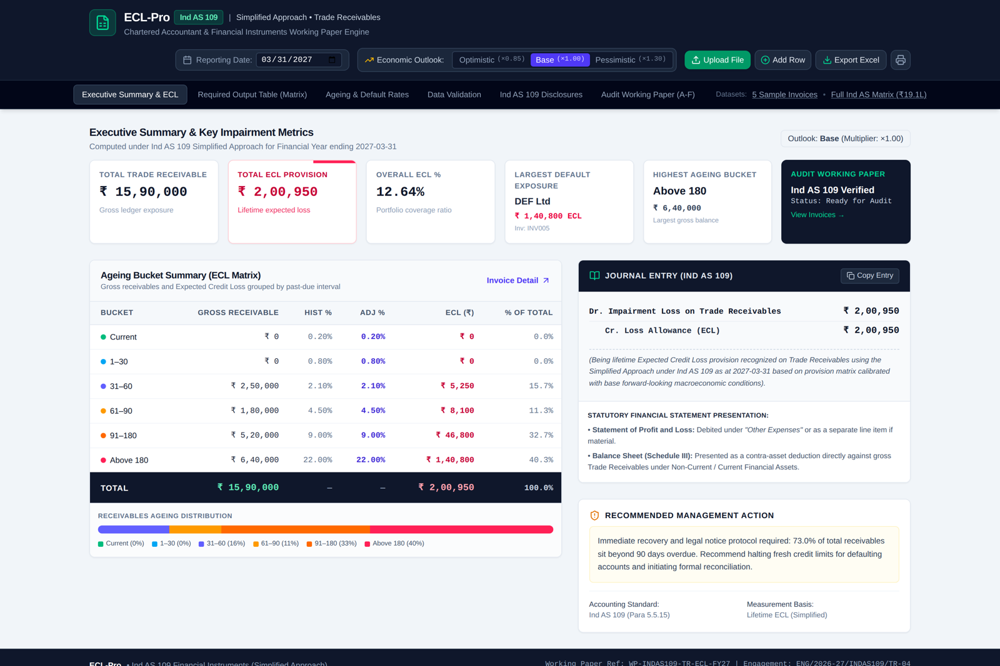
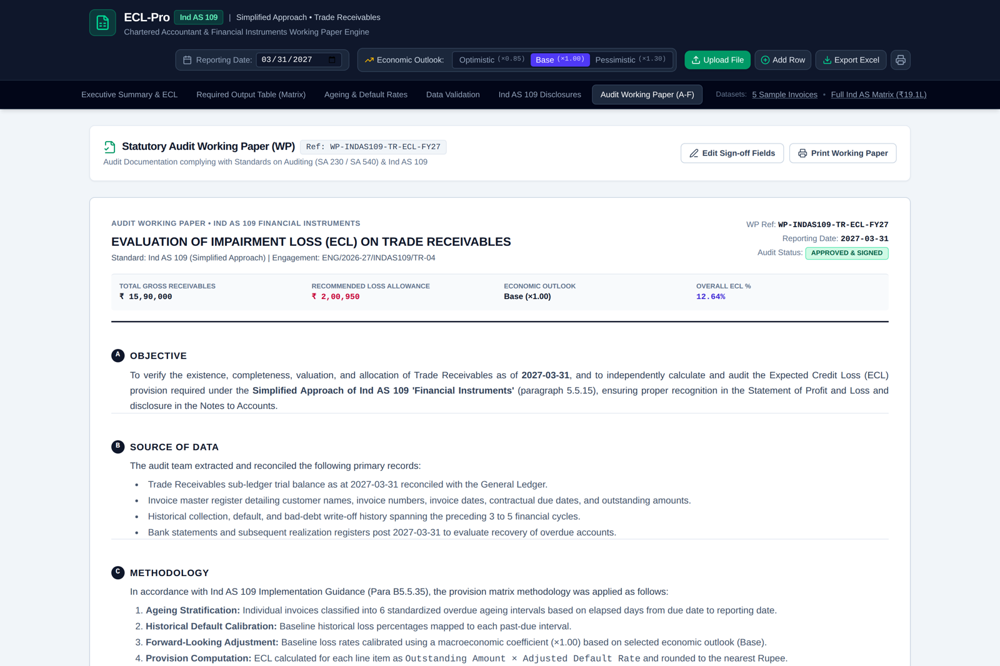
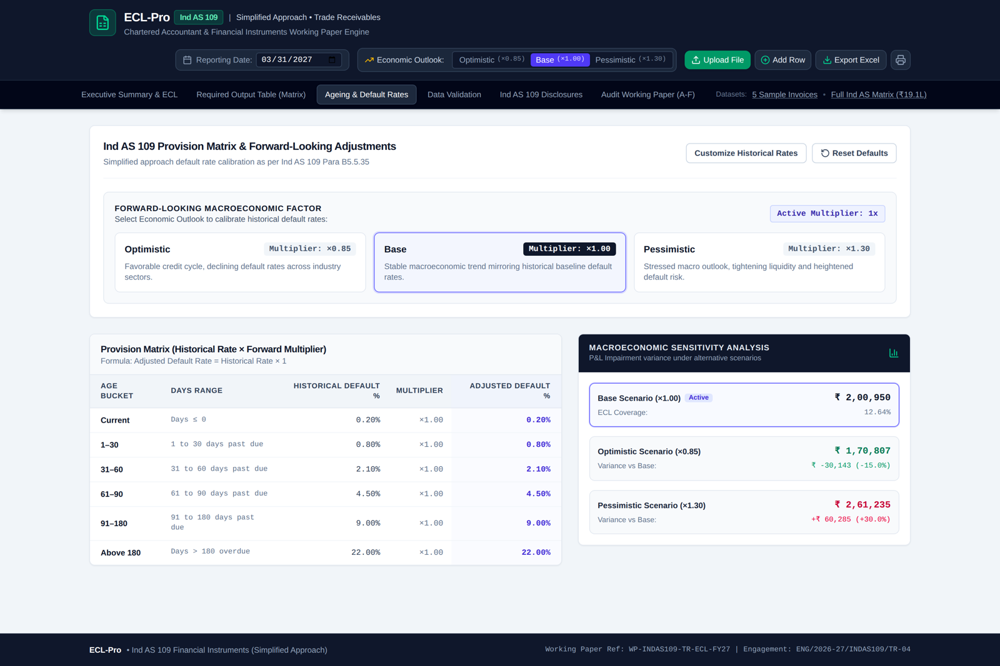
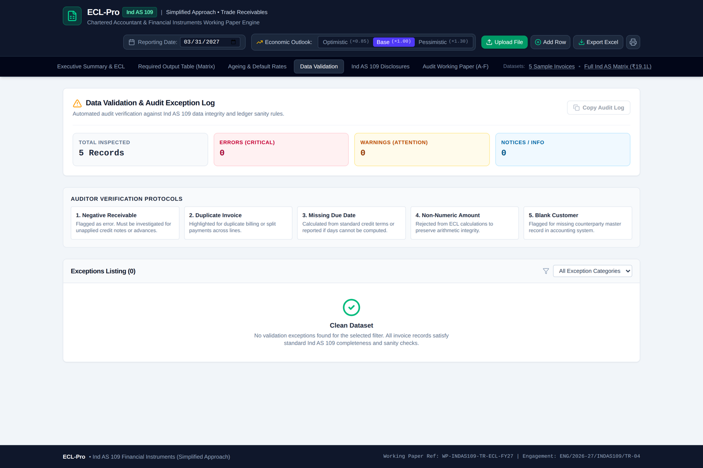

# ECL-Pro — Ind AS 109 Expected Credit Loss Working Paper

An offline, browser-based Expected Credit Loss (ECL) engine and statutory audit working paper generator for **trade receivables** under the **Ind AS 109 simplified approach**.

Built as an AICA Level-2 capstone project using AI-assisted development in Google AI Studio.

**Author:** CA Abinash Parida · Batch B-86

---

## What it does

Every entity applying Ind AS must carry a lifetime ECL allowance on trade receivables. In practice that provision matrix is rebuilt by hand in Excel each year — ageing pasted from Tally, buckets typed manually, percentages hard-coded in cells, and no documented methodology or sign-off trail behind the number.

ECL-Pro takes a receivables ledger and produces the provision, the exception report, the disclosure note and the audit working paper in one pass. It runs entirely in the browser: no server, no install, and no client data leaves the machine.

## Methodology

Lifetime ECL under the simplified approach — Ind AS 109 paragraph 5.5.15, read with Implementation Guidance B5.5.35. No 12-month / three-stage split, as trade receivables carry no significant financing component.

```
ECL per invoice = Outstanding Amount x (Historical Default Rate for its ageing bucket
                                        x Forward-looking Multiplier)
```

### Provision matrix

| Ageing bucket | Days past due | Historical default % | Optimistic x0.85 | Base x1.00 | Pessimistic x1.30 |
|---|---|---|---|---|---|
| Current   | On or before due date | 0.20%  | 0.17%  | 0.20%  | 0.26%  |
| 1–30      | 1 to 30 days          | 0.80%  | 0.68%  | 0.80%  | 1.04%  |
| 31–60     | 31 to 60 days         | 2.10%  | 1.79%  | 2.10%  | 2.73%  |
| 61–90     | 61 to 90 days         | 4.50%  | 3.83%  | 4.50%  | 5.85%  |
| 91–180    | 91 to 180 days        | 9.00%  | 7.65%  | 9.00%  | 11.70% |
| Above 180 | More than 180 days    | 22.00% | 18.70% | 22.00% | 28.60% |

Days past due are computed from the invoice due date against the reporting date. Where the ledger already carries a days-outstanding figure, that value is used and the row is noted in the exceptions report.

A single forward-looking macroeconomic coefficient scales every historical rate, so the judgement is explicit and testable by the reviewer instead of buried in cell formulas. Historical rates are editable in the application.

### Data validation

Five rule classes run over every row before any provision is computed:

| Rule | Severity |
|---|---|
| Negative receivable | Error |
| Non-numeric amount | Error |
| Missing due date with no days-outstanding | Error |
| Duplicate invoice number | Warning |
| Blank customer name | Warning |

## Modules

| Tab | Purpose |
|---|---|
| Executive Summary & ECL | Headline metrics, ageing bucket matrix, journal entry, recommended management action |
| Required Output Table | Invoice-level matrix: customer, outstanding, days, bucket, historical %, adjusted %, ECL |
| Ageing & Default Rates | Editable provision matrix and forward-looking outlook selection |
| Data Validation | Exception log with severity, rule breached and original row data |
| Ind AS 109 Disclosures | Disclosure note, loss allowance movement, Schedule III presentation |
| Audit Working Paper (A–F) | SA 230 / SA 540 documentation with three-level sign-off |

## Outputs

- **Excel workbook** — four sheets: `ECL_Summary`, `Invoice_ECL_Matrix`, `Validation_Exceptions`, `Audit_WP_Signoff`
- **CSV** — the required output matrix
- **Journal entry** — Dr Impairment Loss on Trade Receivables / Cr Loss Allowance, with narration and reporting date
- **Audit working paper** — printable, carrying the working paper reference, engagement code and audit status

## Illustrative run

Five-invoice sample portfolio, reporting date 31-03-2027, base outlook:

| Metric | Value |
|---|---|
| Total trade receivables (gross) | ₹ 15,90,000 |
| Total ECL provision | ₹ 2,00,950 |
| Overall ECL % | 12.64% |
| Concentration beyond 90 days | 73.0% |

Sensitivity: ₹ 1,70,807 (10.74%) optimistic · ₹ 2,61,235 (16.43%) pessimistic.

## Demo

A recorded walkthrough of the application is available here:
**[Video demo (Google Drive)](https://drive.google.com/drive/u/0/folders/1Bv5ZUmuP7IRWLF7OSm590O-vnYTM2aFO)**

## Screenshots

| Executive Summary | Audit Working Paper |
|---|---|
|  |  |

| Ageing & Default Rates | Data Validation |
|---|---|
|  |  |

Further screens: [output matrix](docs/screenshots/02-output-matrix.png) · [disclosures](docs/screenshots/05-disclosures.png)

## Running it locally

**Prerequisites:** Node.js 18 or later.

```bash
npm install
npm run dev
```

Then open http://localhost:3000.

On Windows, `run.bat` does all of the above and opens the browser for you.

To build a static bundle:

```bash
npm run build     # output in dist/
npm run preview
```

No API key is required — the ECL engine is pure TypeScript and makes no network calls. `.env.example` exists only because the project was scaffolded in Google AI Studio.

## Tech stack

React 19 · TypeScript · Vite · Tailwind CSS · SheetJS (`xlsx`) for Excel export · generated and iterated in Google AI Studio.

## Project structure

```
src/
  App.tsx                    application shell and state
  types.ts                   domain types
  data/sampleData.ts         default rates, outlook multipliers, sample datasets
  utils/eclCalculations.ts   ageing, bucketing, validation, ECL computation
  utils/excelExport.ts       four-sheet workbook and CSV export
  components/                the six views plus upload and add-invoice modals
docs/
  ECL-Pro-Capstone-Deck.pdf  project presentation
  screenshots/               application screens
```

## Limitations

- Default rates are entered by the user, not derived from the client's own roll-rate history.
- A single macroeconomic multiplier stands in for a full probability-weighted scenario model.
- Simplified approach only — no three-stage model for loans or debt instruments.
- No direct Tally / ERP link; data arrives by Excel or CSV upload.
- State lives in the browser session; nothing is persisted between runs.

The tool is a working-paper aid. Rate selection, outlook and the final provision remain the professional judgement of the engagement partner.

## Roadmap

- Derive historical default rates automatically from three to five years of uploaded ageing data
- Multi-scenario probability weighting with documented scenario weights
- Direct Tally / Zoho / ERP receivables import
- Customer-segment and geography-wise matrices within one engagement
- PDF working paper export with digital sign-off and version history

## Licence

Prepared for academic submission. Not a substitute for professional judgement in a statutory audit.
